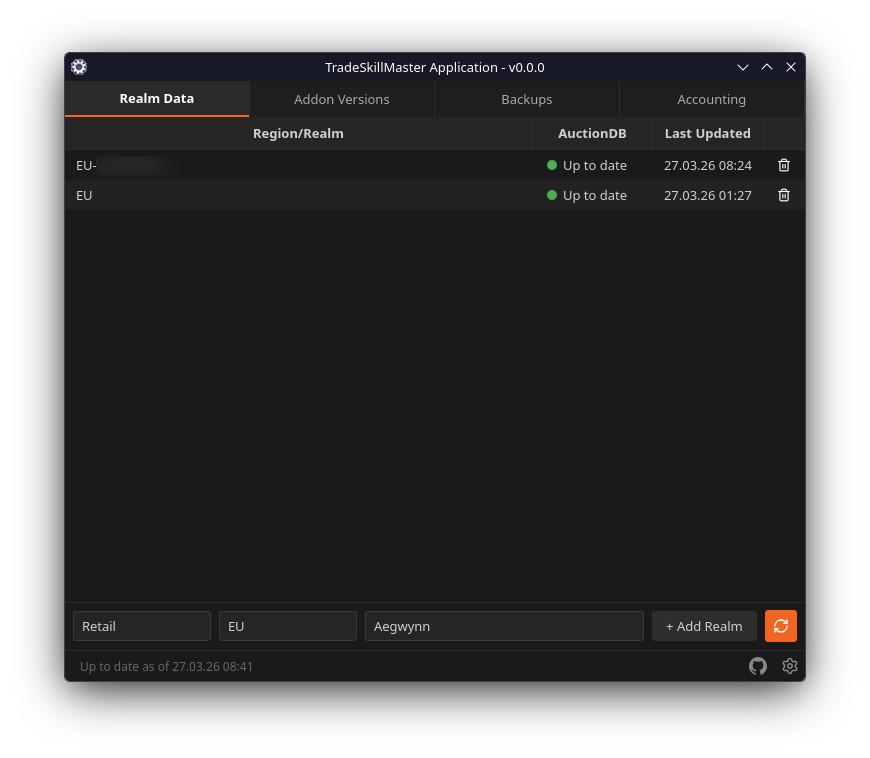
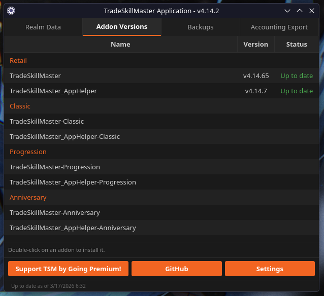
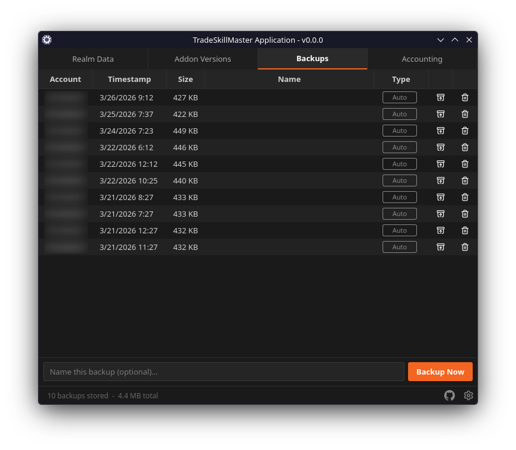
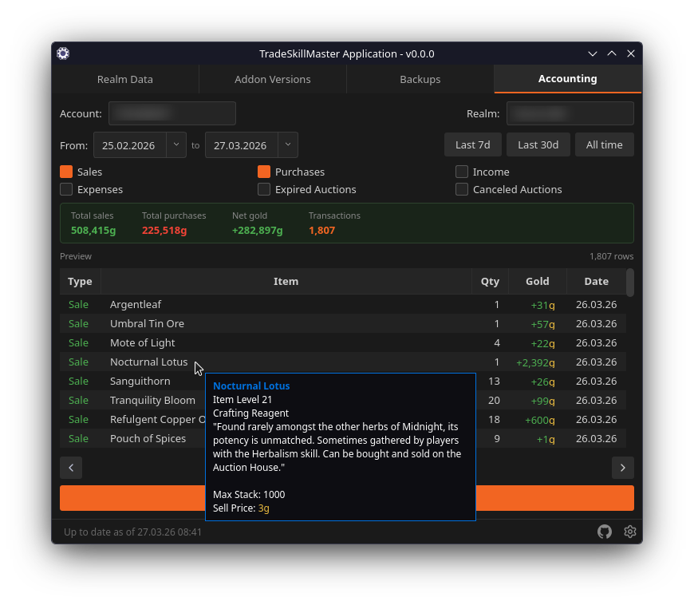
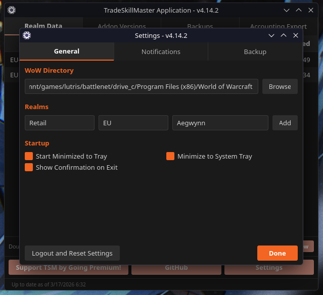
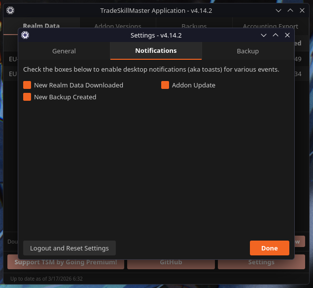
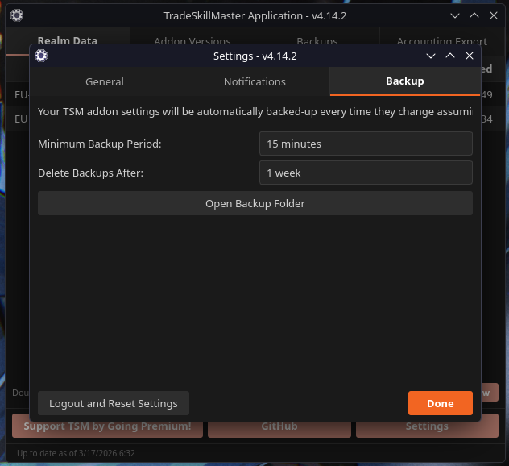

# TSM App for Linux


TradeSkillMaster Desktop App Linux port. Authenticates with the TSM API, downloads auction data, and writes `AppData.lua` for the TSM addon running under Wine/Lutris/Steam.

## Screenshots

### Main window






### Settings





## Features

- TSM account login with secure credential storage (keyring / Secret Service)
- Automatic auction data sync every 60 minutes; manual refresh on demand
- WoW install auto-detection for Wine, Lutris, Steam, and custom paths
- Atomic `AppData.lua` writes: no partial/corrupt addon data
- Scheduled SavedVariables backups with restore support
- TSM addon version checking and auto-update
- System tray icon with minimise-to-tray support

## Requirements

- Python 3.11+
- PySide6 (Qt6)
- World of Warcraft running via Wine, Lutris, or Steam on Linux

## Installation

### Arch Linux

```bash
# Via AUR helper (recommended)
yay -S tsm-app

# Or manually
git clone https://aur.archlinux.org/tsm-app.git
cd tsm-app
makepkg -si
```

### Debian / Ubuntu

Download the `.deb` from the [latest release](https://github.com/exceptionptr/tsm-app-linux/releases/latest):

```bash
sudo dpkg -i tsm-app_*_all.deb
```

> **Note:** Requires `python3-pyside6` and Python 3.11+. On older Ubuntu releases some
> Python dependencies may not be packaged. Use the "From source" method in that case.

### Fedora / RHEL / openSUSE

Download the `.rpm` from the [latest release](https://github.com/exceptionptr/tsm-app-linux/releases/latest):

```bash
sudo dnf install tsm-app-*.noarch.rpm
```

### Any distro / From source

```bash
git clone https://github.com/exceptionptr/tsm-app-linux
cd tsm-app-linux
python -m venv .venv
source .venv/bin/activate
pip install -e ".[dev]"
```

### Run

```bash
python -m tsm
# or after package / pip install:
tsm-app
```

## WoW Detection

The app scans the following paths automatically on startup and every 5 minutes:

| Source                  | Path                                                      |
| ----------------------- | --------------------------------------------------------- |
| Wine (default prefix)   | `~/.wine/drive_c/Program Files (x86)/World of Warcraft`   |
| Lutris                  | `~/Games/world-of-warcraft`                               |
| Steam                   | `~/.local/share/Steam/steamapps/common/World of Warcraft` |
| Mount (games partition) | `/mnt/games/World of Warcraft`                            |
| System opt              | `/opt/games/World of Warcraft`                            |

If your WoW installation isn't detected automatically, add the path manually via **Settings → WoW Installations**.

## Architecture

| Layer        | Module                          | Purpose                                              |
| ------------ | ------------------------------- | ---------------------------------------------------- |
| Entry point  | `tsm/__main__.py`, `tsm/app.py` | QApplication setup, dependency wiring                |
| Async runner | `tsm/workers/async_runner.py`   | Dedicated asyncio loop on a QThread                  |
| Bridge       | `tsm/workers/bridge.py`         | Submit coroutines, emit Qt signals with results      |
| Scheduler    | `tsm/core/scheduler.py`         | APScheduler 4.x periodic jobs                        |
| Services     | `tsm/core/services/`            | Auth, auction data, backup, addon updater            |
| Storage      | `tsm/storage/`                  | SQLite cache, TOML config, keyring secrets           |
| WoW          | `tsm/wow/`                      | Install detection, Lua writer, SavedVariables reader |
| UI           | `tsm/ui/`                       | MVVM views + viewmodels (PySide6)                    |
| API client   | `tsm/api/client.py`             | aiohttp TSM API client with retry logic              |

## Development

```bash
# Run tests
pytest tests/ -v

# Lint
ruff check tsm/ tests/

# Type check
mypy tsm/

# Build wheel
python -m build --wheel
```

## Acknowledgements

Big thanks to the [TradeSkillMaster](https://tradeskillmaster.com/) team for building and maintaining the TSM ecosystem: the addon, the API, and the auction data infrastructure that makes all of this possible.

## License

MIT
