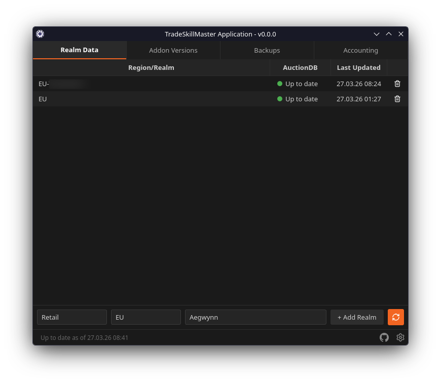
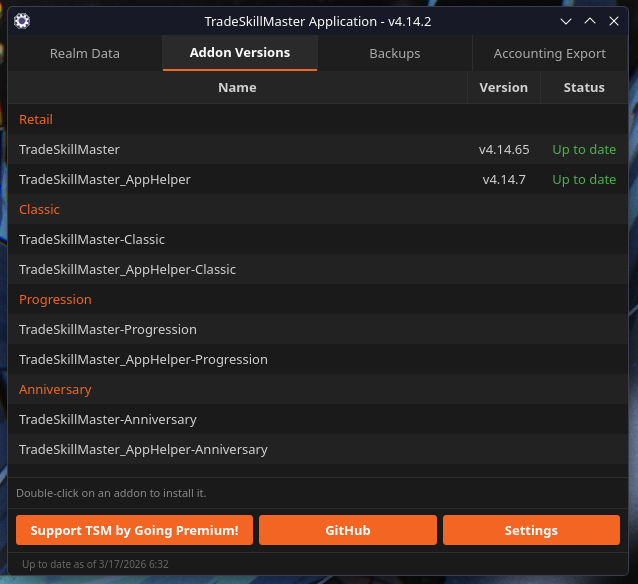
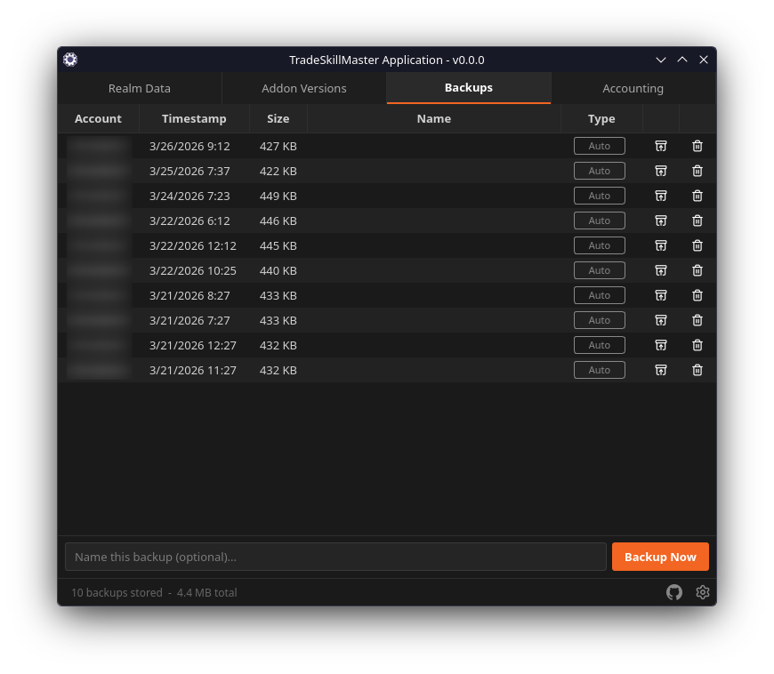
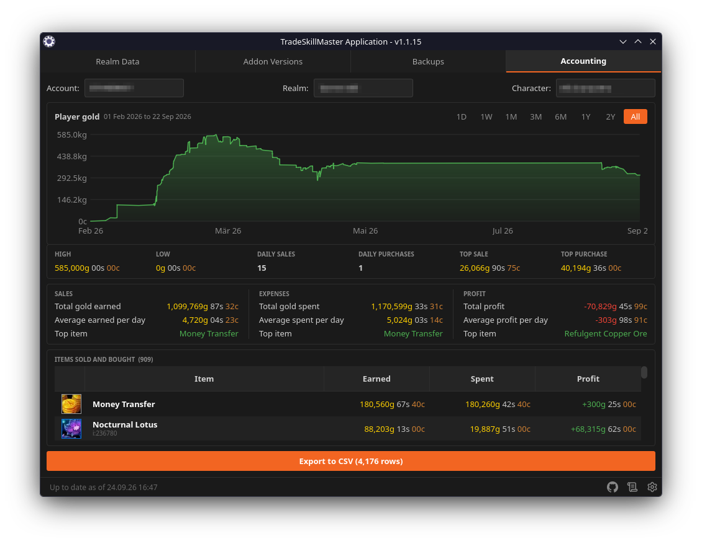
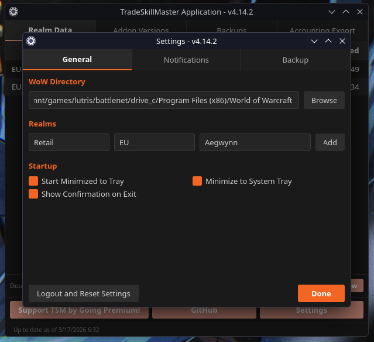
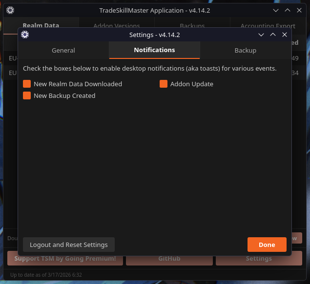
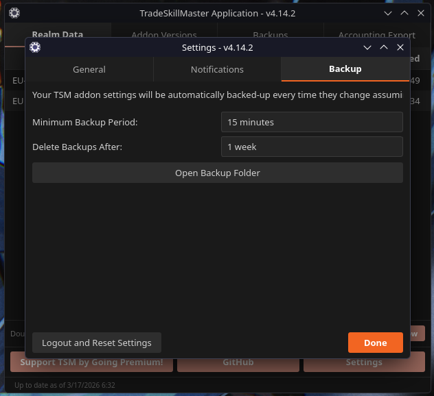

# TSM App for Linux


TradeSkillMaster Desktop App Linux port. Authenticates with the TSM API, downloads auction data, and writes `AppData.lua` for the TSM addon running under Wine/Lutris/Steam.

## Screenshots

### Main window

| | |
|---|---|
|  |  |
|  |  |

### Settings

| | | |
|---|---|---|
|  |  |  |

## Features

- TSM account login with secure credential storage (keyring / Secret Service)
- Automatic auction data sync every 5 minutes (differential - only changed blobs downloaded); manual refresh on demand
- WoW install auto-detection for Wine, Lutris, Faugus Launcher, Steam, and custom paths
- Atomic `AppData.lua` writes: no partial/corrupt addon data
- Scheduled SavedVariables backups with restore support
- TSM addon version checking with auto-update on each sync; manual install, update, and uninstall per addon per game version from the Addon Versions tab
- Accounting dashboard: player gold over time with a hover readout and 1D to All ranges, headline figures (high, low, daily sales and purchases, top sale and purchase), Sales / Expenses / Profit panels with totals, per-day averages and leading items, and every item traded with its icon framed in its quality colour, earned, spent and profit columns, WoW-style tooltips on hover, and CSV export
- Status bar with GitHub link and Settings shortcut; system tray icon with minimise-to-tray support

## Requirements

- World of Warcraft running via Wine, Lutris, Proton, Faugus Launcher, or Steam on Linux
- A TradeSkillMaster account

The Flatpak, AppImage and Nix packages carry everything else they need. Only the
deb, rpm, AUR and from-source installs require the system to provide:

- Python 3.11+
- PySide6 (Qt6)

## Installation

### Arch Linux

```bash
# Via AUR helper (recommended)
paru -S tsm-app

# Or manually
git clone https://aur.archlinux.org/tsm-app.git
cd tsm-app
makepkg -si
```

### Debian / Ubuntu 26.04+

The `.deb` package requires **Ubuntu 26.04 or later** - PySide6 is only available
via apt on 26.04+, and APScheduler 4.x (not in Ubuntu repos) is bundled inside the package.

Download the `.deb` from the [latest release](https://github.com/exceptionptr/tsm-app-linux/releases/latest):

```bash
sudo apt install ./tsm-app_*_all.deb
```

**Ubuntu 24.04 or earlier:** PySide6 is not in the apt repos on these versions.
Install via pip into a virtual environment instead - see [From source / pip wheel](#any-distro--from-source) below.

### Fedora / RHEL / openSUSE

Download the `.rpm` from the [latest release](https://github.com/exceptionptr/tsm-app-linux/releases/latest):

```bash
sudo dnf install tsm-app-*.noarch.rpm
```

### Flatpak (any distro)

Download the bundle from the [latest release](https://github.com/exceptionptr/tsm-app-linux/releases/latest).
It carries its own Python and Qt, so no distro PySide6 is needed:

```bash
flatpak install ./io.github.exceptionptr.tsm-app-linux.flatpak
flatpak run io.github.exceptionptr.tsm-app-linux
```

The bundle is not a repository, so it does not update itself. Install a newer
release the same way to upgrade.

### AppImage (any distro)

One file with Python, Qt and every dependency inside. Around 240 MB:

```bash
chmod +x TSM_Desktop_App-*.AppImage
./TSM_Desktop_App-*.AppImage
```

If it will not start, your system is probably missing FUSE. Either install
`fuse2`, or run it without FUSE:

```bash
APPIMAGE_EXTRACT_AND_RUN=1 ./TSM_Desktop_App-*.AppImage
```

It bundles Python and Qt, but still uses a few libraries from the host: glib,
fontconfig, libGL, dbus, and the usual xcb set on X11. Every desktop
installation has these; a minimal container may not. `tsm-app --self-test` says
which one is missing if it fails.

### NixOS

Run it straight from the flake:

```bash
nix run github:exceptionptr/tsm-app-linux
```

Nix ships with flakes turned off unless you are on NixOS, so that may fail with
`experimental Nix feature 'nix-command' is disabled`. Either pass them for one
command:

```bash
nix --extra-experimental-features 'nix-command flakes' \
  run github:exceptionptr/tsm-app-linux
```

or turn them on for good:

```bash
mkdir -p ~/.config/nix
echo 'experimental-features = nix-command flakes' >> ~/.config/nix/nix.conf
```

Or install it on NixOS, in your system's `flake.nix`:

```nix
{
  inputs = {
    nixpkgs.url = "github:NixOS/nixpkgs/nixos-unstable";
    tsm-app.url = "github:exceptionptr/tsm-app-linux";
  };

  outputs = { nixpkgs, tsm-app, ... }: {
    nixosConfigurations.myhost = nixpkgs.lib.nixosSystem {
      system = "x86_64-linux";
      modules = [
        ./configuration.nix
        (
          { pkgs, ... }:
          {
            # Builds against your nixpkgs, so it shares the Qt and Python you
            # already have instead of pulling in a second copy of both.
            nixpkgs.overlays = [ tsm-app.overlays.default ];
            environment.systemPackages = [ pkgs.tsm-app ];
          }
        )
      ];
    };
  };
}
```

The overlay only adds `tsm-app` and `apscheduler4`, and overrides nothing, so it
cannot trigger rebuilds elsewhere in your system.

If your nixpkgs is too old to evaluate the package, take it pre-built against
the version this flake pins instead. That always builds, at the cost of a second
Qt closure in your store:

```nix
environment.systemPackages = [
  tsm-app.packages.${pkgs.stdenv.hostPlatform.system}.default
];
```

### Any distro / From source

Recommended for Ubuntu 24.04 and distros without a compatible PySide6 package:

```bash
# From the pre-built wheel (no git required)
python3 -m venv .venv
source .venv/bin/activate
pip install tsm_app-*.whl   # download .whl from the latest release

# Or from source
git clone https://github.com/exceptionptr/tsm-app-linux
cd tsm-app-linux
python3 -m venv .venv
source .venv/bin/activate
pip install -e .
```

### Run

```bash
python -m tsm
# or after package / pip install:
tsm-app
```

## Troubleshooting

If the app will not start, check whether the GUI stack loads:

```bash
tsm-app --self-test
```

It prints the Python, PySide6 and Qt versions and the Qt platform plugin in use,
without touching your database, keyring or credentials. Include its output when
reporting a problem.

## File Locations

| Purpose       | Path                                          |
| ------------- | --------------------------------------------- |
| Config        | `~/.config/tsm-app/config.toml`               |
| Database      | `~/.local/share/tsm-app/data.db`              |
| Log file      | `~/.local/share/tsm-app/logs/tsm-app.log`     |
| Backups       | `~/.local/share/tsm-app/backups/`             |
| Item cache    | `~/.local/share/tsm-app/item_cache.json`      |

Logs rotate automatically; the last 5 files are kept. To reset the app to a clean
state, remove `~/.config/tsm-app/` and `~/.local/share/tsm-app/`.

## WoW Detection

The app scans the following paths automatically on startup:

| Source                  | Path                                                                                          |
| ----------------------- | --------------------------------------------------------------------------------------------- |
| Wine (default prefix)   | `~/.wine/drive_c/Program Files (x86)/World of Warcraft`                                      |
| Wine (default prefix)   | `~/.wine/drive_c/Program Files/World of Warcraft`                                             |
| Lutris (common)         | `~/Games/world-of-warcraft`                                                                   |
| Lutris (common)         | `~/Games/World of Warcraft`                                                                   |
| Lutris (config)         | Wine prefix read from `~/.local/share/lutris/games/*.yml`, both Program Files variants        |
| Faugus Launcher (config)| Wine prefix read from `~/.config/faugus-launcher/games.json`, both Program Files variants    |
| Faugus Launcher (common)| All subdirectories of `~/Faugus/`, both Program Files variants                               |
| Steam                   | `~/.local/share/Steam/steamapps/common/World of Warcraft`                                    |
| Snap Wine               | `~/snap/wine-platform-5-stable/common/.wine/drive_c/Program Files (x86)/World of Warcraft`   |
| Mount (games partition) | `/mnt/games/World of Warcraft`                                                                |
| System opt              | `/opt/games/World of Warcraft`                                                                |

If your WoW installation isn't detected automatically, add the path manually via **Settings -> WoW Installations**.

## Architecture

| Layer        | Module                          | Purpose                                              |
| ------------ | ------------------------------- | ---------------------------------------------------- |
| Entry point  | `tsm/__main__.py`, `tsm/app.py` | QApplication setup, dependency wiring                |
| Async runner | `tsm/workers/async_runner.py`   | Dedicated asyncio loop on a QThread                  |
| Bridge       | `tsm/workers/bridge.py`         | Submit coroutines, emit Qt signals with results      |
| Scheduler    | `tsm/core/scheduler.py`         | APScheduler 4.x periodic jobs                        |
| Services     | `tsm/core/services/`            | Auth, auction data, backup, addon updater            |
| Storage      | `tsm/storage/`                  | SQLite cache, TOML config, keyring secrets           |
| WoW          | `tsm/wow/`                      | Install detection, Lua writer, SavedVariables reader |
| UI           | `tsm/ui/`                       | MVVM views + viewmodels (PySide6)                    |
| API client   | `tsm/api/client.py`             | aiohttp TSM API client with retry logic              |

## Development

```bash
# Install with dev dependencies
pip install -e ".[dev]"

# Run tests
pytest tests/ -v

# Lint
ruff check tsm/ tests/

# Type check
mypy tsm/

# Build wheel
python -m build --wheel
```

## Acknowledgements

Big thanks to the [TradeSkillMaster](https://tradeskillmaster.com/) team for building and maintaining the TSM ecosystem: the addon, the API, and the auction data infrastructure that makes all of this possible.

## License

MIT
